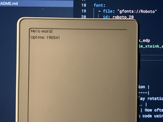

# Xteink X4 ESPHome Component

ESPHome components for Xteink X4 e-reader (ESP32-C3).

Currently, this repo only contains the display component. Button components will be added soon.

## Usage

Requires `partitions.csv` and `package_xteink_x4.yml` from this repo:

```yaml
external_components:
  - source: github://ngxson/esphome-component-xteink
    components:
      - xteink_edp

# IMPORANT: this contains the hardware definitions of Xteink X4
packages:
  common: !include
    file: package_xteink_x4.yml

font:
  - file: "gfonts://Roboto"
    id: roboto_20
    size: 20

display:
  - platform: xteink_edp
    # ... See example_xteink_edp.yml for the complete code
```

This outputs:



Advanced options:

```yaml
# EXAMPLE: custom refresh mode
display:
  - platform: xteink_edp
    lambda: |-
      // draw your content, then set the refresh mode
      it.set_refresh_mode(1);

      // available modes:
      // - 0 (FULL_REFRESH): Full refresh with complete waveform
      // - 1 (HALF_REFRESH): Half refresh (1720ms) - balanced quality and speed
      // - 2 (FAST_REFRESH): Fast refresh (partial update)

      // you can also manually track the display update count
      // for example, force full update after 10 updates
      if (update_count % 10 == 0) {
        it.set_refresh_mode(0); // full update
      } else {
        it.set_refresh_mode(2); // fast update
      }
```
